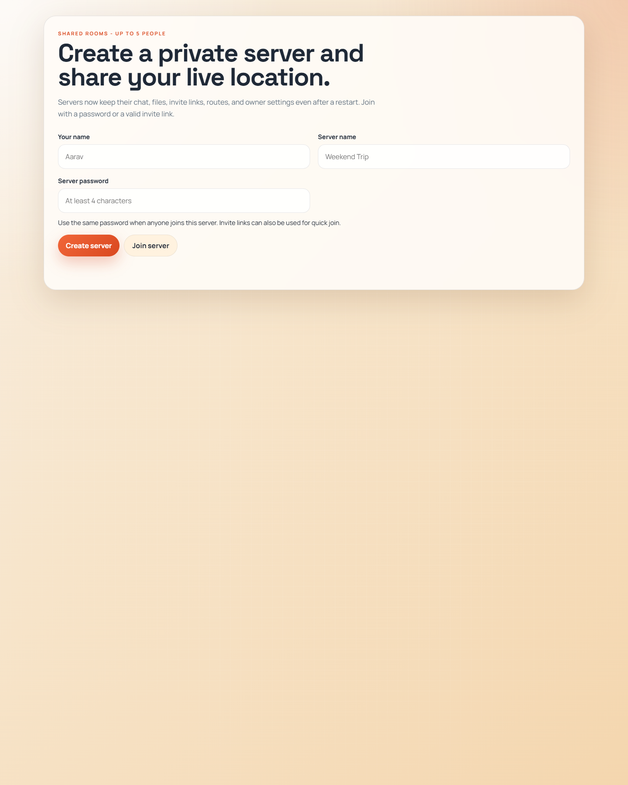
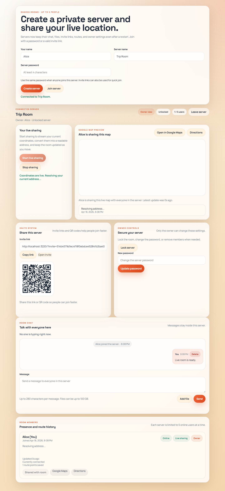

# Live Location Servers

Live Location Servers is a real-time private room app where people can create or join password-protected servers, chat, upload files, and share one live location stream at a time with everyone in the room.

The project is built with Node.js, Express, Socket.IO, SQLite, and a simple frontend in vanilla HTML, CSS, and JavaScript.

## Screenshots

### Entry Screen

Users enter their name, server name, and password to create or join a room.



### Owner Live Room

This view shows an active room with live sharing, Google Maps preview, invite tools, owner controls, chat, and member presence.



## What This App Does

- Create private servers with a password.
- Join existing servers with the same password or with an invite link.
- Limit each server to `5` online users at a time.
- Keep room data after restart with SQLite persistence.
- Share one live location stream at a time for the whole server.
- Show the shared live map to everyone in the room.
- Keep the room map blank when nobody is actively sharing.
- Convert live coordinates into a readable address.
- Open the current location or directions in Google Maps.
- Send chat messages inside the room.
- Upload and download files in chat with progress feedback.
- Generate invite links and QR codes.
- Let the owner lock the room, change the password, kick users, and delete messages.

## Features Explained

### Private servers

Each room acts like a small private server. A user can create one by entering:

- their name
- a server name
- a password

Other users can join the same server by entering the same server name and password, or by opening a valid invite link.

### Live location sharing

The app does not allow multiple people to actively share live location at the same time.

- Only one user can control the shared live map at once.
- If somebody else tries to start sharing, the current sharer gets a warning.
- The second user has to wait until the current sharer stops.
- While one user is sharing, that live map is shown to everyone in the room.
- When the current sharer stops, the room map becomes blank again.

### Google Maps support

The room includes:

- an embedded Google Maps preview for the active sharer
- an `Open in Google Maps` link
- a `Directions` link

### Chat and files

Each server has its own chat room with:

- real-time messages
- typing indicator
- unread badge
- file uploads
- file download links
- upload progress

### Owner controls

The room owner can:

- lock or unlock the server
- change the password
- kick online users
- delete chat messages

### Persistence

The app stores room data in SQLite so it stays available after restart, including:

- room records
- password hashes
- invite tokens
- room profiles
- route history
- chat messages
- uploaded file references

## How To Run

### Prerequisites

- Node.js installed
- npm installed

### Install dependencies

Standard shell:

```bash
npm install
```

Windows PowerShell:

```powershell
npm.cmd install
```

### Start the app

Standard shell:

```bash
npm start
```

Windows PowerShell:

```powershell
npm.cmd start
```

### Open it in the browser

```text
http://localhost:3000
```

### Development mode

Standard shell:

```bash
npm run dev
```

Windows PowerShell:

```powershell
npm.cmd run dev
```

## How To Use

1. Open the app in your browser.
2. Enter your user name.
3. Enter a server name.
4. Enter a password.
5. Click `Create server` if you are creating a new room.
6. Click `Join server` if the room already exists.
7. Use `Start live sharing` to request control of the shared map.
8. If the map is free, your live location becomes the room’s shared map.
9. If somebody else is already sharing, you will have to wait.
10. Use the room chat to send messages and files.
11. Use invite links or QR codes to bring more people into the same room.

## How It Works

### 1. Room creation and joining

- The frontend sends room actions through Socket.IO.
- The backend validates the user name, server name, password, and invite token.
- Passwords are not stored as plain text. They are hashed before saving.

### 2. Real-time communication

- Socket.IO handles room joins, live presence, chat, typing, and location updates.
- Every room state update is broadcast to everyone currently connected to that server.

### 3. Live map sharing flow

The shared map works like this:

1. A user clicks `Start live sharing`.
2. The browser asks the server for permission to take the live map.
3. If no one else is currently sharing, the server approves it.
4. The approved browser starts geolocation updates.
5. The latest live location becomes the shared room map for everyone.
6. If another user tries to share at the same time, the request is blocked.
7. When the active sharer stops, the room map goes blank.

### 4. Address lookup

- The browser gets latitude and longitude from geolocation.
- The app then looks up a readable address from those coordinates.
- That address is shown in the room and stored with route history.

### 5. Chat and files

- Chat messages are sent through Socket.IO.
- Files are uploaded through Express and Multer.
- Uploaded files are stored on disk and referenced in chat history.

### 6. Persistence

- SQLite stores rooms, profiles, messages, and route points.
- Uploaded files are stored in the `uploads/` folder.
- On server startup, saved rooms and data are loaded back into memory.

## Tech Stack

- Node.js
- Express
- Socket.IO
- SQLite (`sqlite3`)
- Multer
- QRCode
- Vanilla HTML
- Vanilla CSS
- Vanilla JavaScript

## Project Structure

```text
server.js                 Main Express + Socket.IO server
public/                   Frontend HTML, CSS, and JavaScript
data/app.sqlite           SQLite database
uploads/                  Uploaded chat files
docs/screenshots/         README screenshots
```

## Data Storage

- Database: `data/app.sqlite`
- Uploaded files: `uploads/`

## Environment

- Default port: `3000`

Example override in `cmd`:

```cmd
set PORT=3210 && npm start
```

Example override in PowerShell:

```powershell
$env:PORT=3210
npm.cmd start
```

## Health Check

The app exposes:

```text
GET /health
```

Example response:

```json
{"ok":true,"rooms":5}
```

## Current Limits

- `5` online users per server
- `280` characters per chat message
- `100 GB` max uploaded file size
- `1` active live sharer per server

## Notes

- Browser geolocation permission is required for live sharing.
- Address lookup depends on internet access and the reverse-geocoding service being reachable.
- The shared map uses Google Maps in the browser.
- Large uploads still depend on the machine having enough free disk space.

## Go Online

- https://adhrit-liveroom-maps.onrender.com
